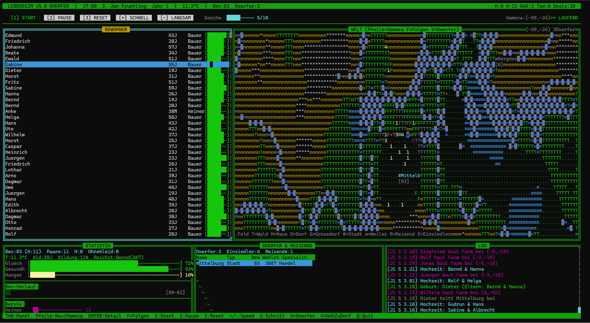
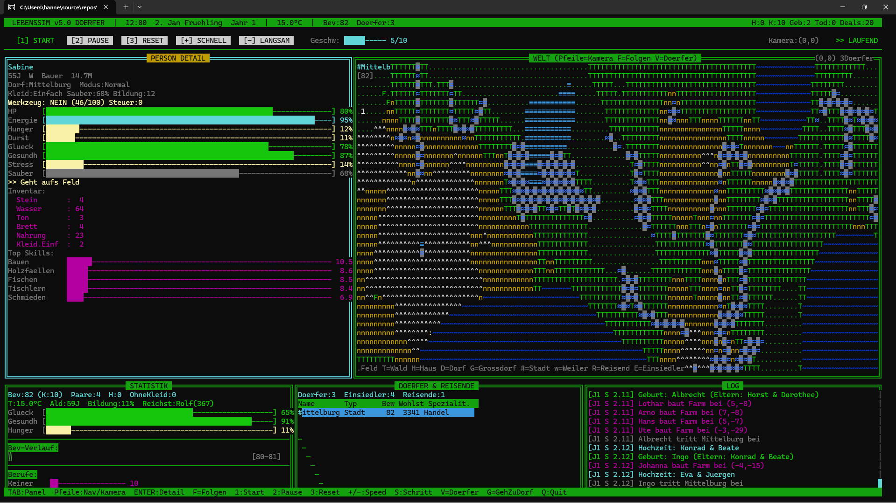
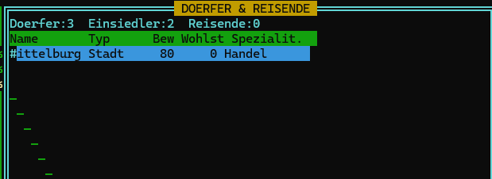
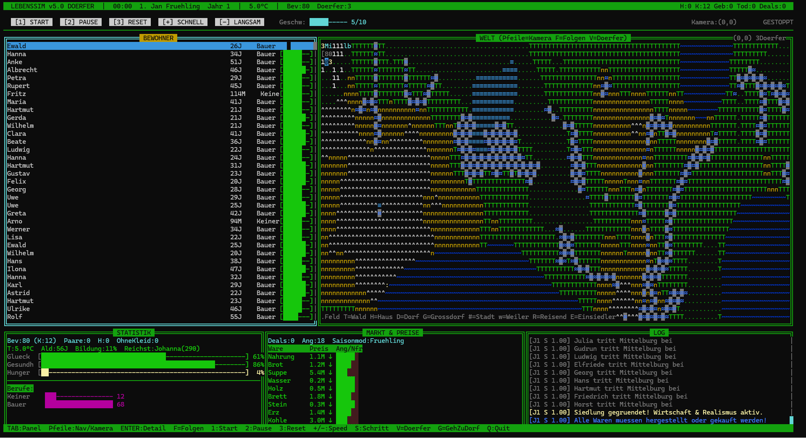

# weld-simulatior

**in diesem projeckt habe ich mit verschiedenen ki modellen eine c++ terminal menschensimulation gebaut**
## Feachers
- paarung
- flexiebles handelssystem
  - preise werden berechnet
  - handel
- weldsystem
  - personenverfolgung
  - biome
  - dörfer
      - werden dynamisch erstellt
- statistiken
- Log
- personenansicht
- merere moduse
  - start
  - pause
  - reset
  - schneller
  - langsamer
- realistuische ereignise
  - krankheiten
  - glück
  - hunger
  - temperatur
  - kleidung
  - wehrung
## Bilder

